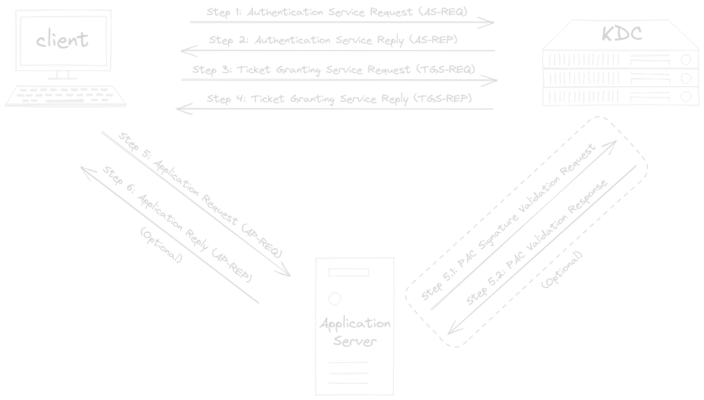
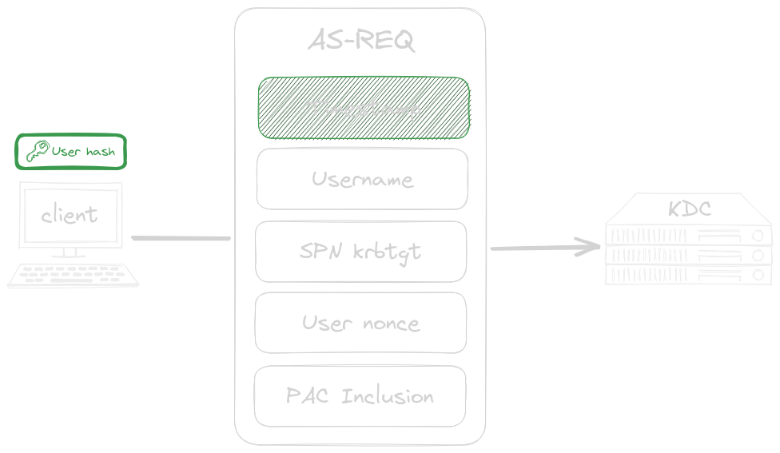
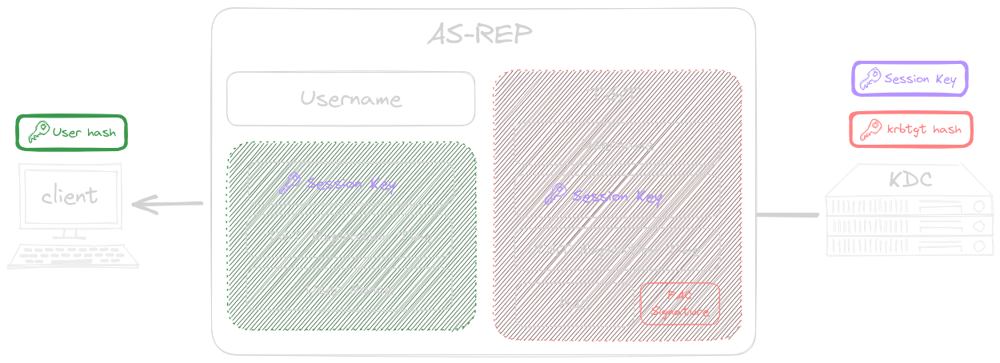
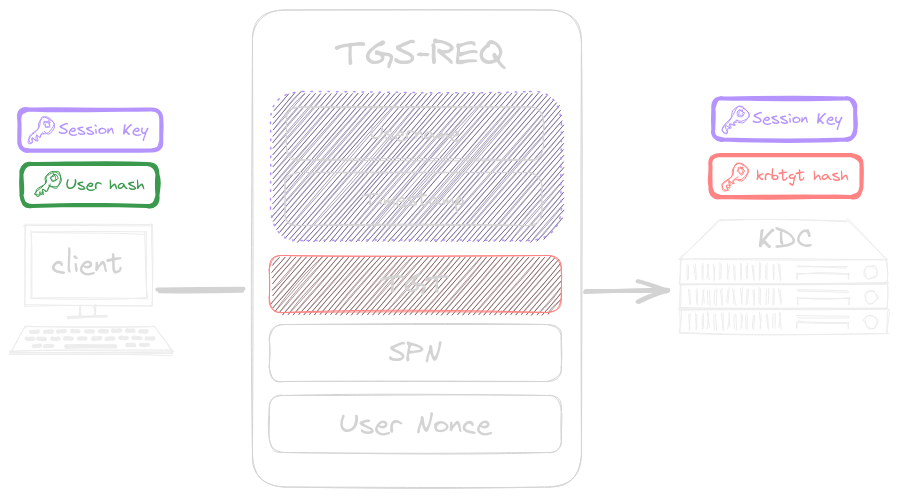
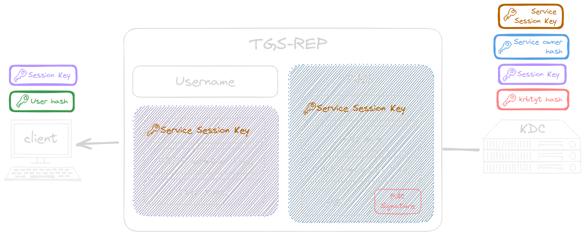
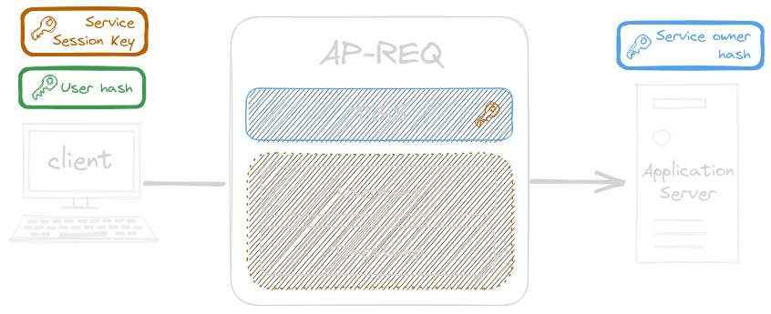
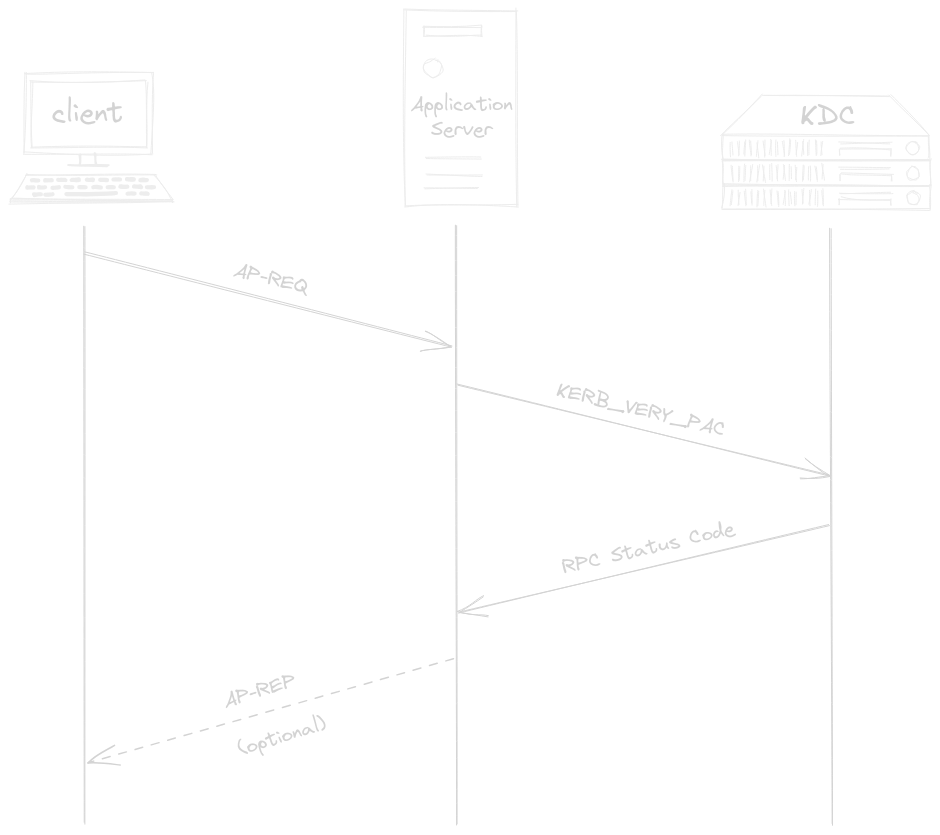
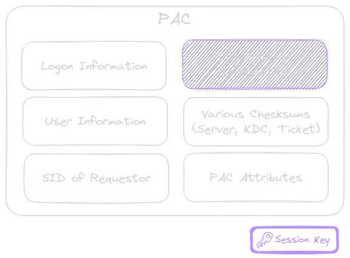

public:: true

- #+BEGIN_QUOTE
  [RFC4120](https://www.rfc-editor.org/rfc/rfc4120): The Kerberos Network Authentication Service (V5)
  [[MS-KILE](https://learn.microsoft.com/en-us/openspecs/windows_protocols/ms-kile/2a32282e-dd48-4ad9-a542-609804b02cc9)]: Kerberos Protocol Extensions *(Microsoft implementation of the Kerberos protocol extension which provides additional capability for authorization information including group memberships, interactive logon information, and integrity levels.)*
  #+END_QUOTE
- A key difference between Kerberos and [[NTLM Authentication]] is that with the latter the client starts the authentication process with the application server itself. On the other hand, Kerberos client authentication involves the use of a domain controller in the role of a **[Key Distribution Center](((6565b3f7-61b6-4b2a-a59d-01d20e6acd96))) (KDC)**. The client starts the authentication process with the KDC and not the application server.
  id:: 655a4269-4fa1-4988-b577-ad77f90064c0
- The *[Privilege Attribute Certificate](((655f3e21-772b-48c3-b6e6-bd342fb92403)))* (PAC) adds **authorization capabilities** to the Microsoft Kerberos implementation, which by itself does not provide authorization.
- **Kerberos Workflow**
  id:: 655a4269-b8f7-4f0f-b437-f04b362912d9
	- The RFC specifies six messages (five mandatory and one optional), grouped into three pairs of sub-protocols:
	- collapsed:: true
	  #+BEGIN_CENTER
	   
	  #+END_CENTER
		- {{renderer excalidraw, excalidraw-2023-11-24-08-37-20}}
	- The authentication service (AS) exchange:
		- Kerberos authentication service request - **AS_REQ**
		- Kerberos authentication service response - **AS_REP**
	- The ticket granting service (TGS) exchange:
		- Kerberos ticket-granting service (TGS) request - **TGS_REQ**
		- Kerberos ticket-granting service (TGS) response - **TGS_REP**
	- The client/server (AP) exchange:
		- Kerberos application server request - **AP_REQ**
		- Kerberos application server response - **AP_REP** *(optional)*
	- **Step 1**
	  id:: 6564d528-ff73-410b-a538-c3dbcd9d039e
		- When a user logs in to their workstation, an *Authentication Server Request* (AS-REQ) is sent to the domain controller.
		  id:: 655a1af9-9f7f-4089-8392-e6d816267e35
			- id:: 655b1c01-e1e1-4be0-b245-ff8c9482df38
			  #+BEGIN_PINNED
			  The **AS-REQ** *(Authentication Service Request)* contains:
			  #+END_PINNED
				- collapsed:: true
				  #+BEGIN_CENTER
				   
				  #+END_CENTER
					- {{renderer excalidraw, excalidraw-2023-11-23-18-29-28}}
				- The timestamp, **encrypted with the user's (NTLM hash) password**
				  logseq.order-list-type:: number
				  id:: 655b158a-a666-41e0-8076-e59942a7bb20
					- This is known as [*Kerberos Pre-Authentication*](https://social.technet.microsoft.com/wiki/contents/articles/23559.kerberos-pre-authentication-why-it-should-not-be-disabled.aspx) (or `PA-ENC-TIMESTAMP`) and prevents offline password guessing. It is enforced by default, but can be manually disabled for specific accounts by explicitly setting [`DONT_REQ_PREAUTH`](https://learn.microsoft.com/en-US/troubleshoot/windows-server/identity/useraccountcontrol-manipulate-account-properties). See the [[ASREPRoast]] attack.
					  id:: 655cc72a-f6bf-40d2-bba0-8384e40186b9
					- #+BEGIN_NOTE
					  According to [[RFC6113](https://datatracker.ietf.org/doc/html/rfc6113#section-2.2)] Windows clients always send an initial **non pre-authenticated** AS-REQ request because the client wouldn't know the list of supported ETYPES. But, since pre-authentication is required by default the KDC server will likely respond with an error *(including acceptable pre-authentication methods)* and closes the connection. The client then has to send another request with an encrypted timestamp value.
					  #+END_NOTE
				- The username
				  logseq.order-list-type:: number
				- The service [SPN](((655e0fad-5b48-42ce-b82a-09cd0e4a9322))) associated with *krbtgt* account
				  logseq.order-list-type:: number
				- A Nonce generated by the client
				  logseq.order-list-type:: number
				- Request to include a [PAC](((655f3e21-772b-48c3-b6e6-bd342fb92403))) in the ticket
				  logseq.order-list-type:: number
				  id:: 656471a5-2bc9-4da9-81ff-906bd9ae41aa
	- **Step 2**
	  id:: 6564d528-4967-4c86-82aa-9168c47ab29c
		- Once the KDC has received the AS-REQ it performs some checks and eventually reply with a AS-REP.
			- If pre-authentication is enable for the requesting user
			  logseq.order-list-type:: number
				- The KDC uses the user's (NTLM hash) password to decrypt the timestamp.
					- If the user was able to successfully encrypt the timestamp with his (NTLM hash) password, then the request was created by himself, and is considered authenticated. Otherwise the `KDC_ERR_PREAUTH_FAILED` error code is returned.
			- In order to defeat potential [replay attack](https://en.wikipedia.org/wiki/Replay_attack) attempts, the KDC checks if the **same timestamp** was already submitted in a previous AS-REQ. If so the authentication fails.
			  logseq.order-list-type:: number
			- If everything is fine, the domain controller replies with an *Authentication Server Reply* (AS-REP).
			  logseq.order-list-type:: number
			  id:: 655a1fb1-47f5-446a-8813-e1a809f05a7b
		- id:: 655b1795-7a37-4e7f-b428-6c9a34ab2cbf
		  #+BEGIN_PINNED
		  The **AS-REP** *(Authentication Service Reply)* contains:
		  #+END_PINNED
			- collapsed:: true
			  #+BEGIN_CENTER
			   
			  #+END_CENTER
				- {{renderer excalidraw, excalidraw-2023-11-23-18-50-49}}
			- The username
			  logseq.order-list-type:: number
				- TODO re-check if it's the *krbtgt* or the requesting user's username
				  background-color:: pink
			- Data **encrypted with the user's (NTLM hash) password**
			  logseq.order-list-type:: number
				- *By returning data encrypted with the user's (NTLM hash) password, the KDC proves to the client that it is the real KDC because only the KDC knows the user's (NTLM hash) password.*
				- A session key
				  logseq.order-list-type:: number
				- The TGT expiration time
				  logseq.order-list-type:: number
				- The same user nonce used in the initial request
				  logseq.order-list-type:: number
					- Used to prevent [replay attacks](https://en.wikipedia.org/wiki/Replay_attack)
			- A *Ticket-Granting Ticket* (TGT) **encrypted with the password (NTLM hash) of the *krbtgt* account**, which is only known by the KDC. *(Cannot be decrypted by the client)*
			  logseq.order-list-type:: number
			  id:: 655a4269-21dc-4947-a21d-5c89e404b561
				- id:: 655b1bc6-5c5d-4c70-9d2b-f3f3d6458cb9
				  #+BEGIN_PINNED
				  The **TGT** *(Ticket-Granting Ticket)* contains:
				  #+END_PINNED
					- The username of the *krbtgt* account
					  logseq.order-list-type:: number
						- TODO re-check if it's always that one and not the requesting user's username
						  background-color:: pink
					- The same [session key above](((655b1795-7a37-4e7f-b428-6c9a34ab2cbf))), but **not encrypted** with the user's (NTML hash) password.
					  logseq.order-list-type:: number
					- The *[PAC](((655f3e21-772b-48c3-b6e6-bd342fb92403)))* ([if requested](((656471a5-2bc9-4da9-81ff-906bd9ae41aa)))).
					  logseq.order-list-type:: number
						- It defines the user's privileges (e.g. group memberships)
						- It will be later used for authorization checks, when the user will requests access to domain services.
					- A signature for the PAC made by the *krbtgt* account
					  logseq.order-list-type:: number
					- TGT expiration time
					  logseq.order-list-type:: number
						- id:: 655f6c2b-0127-41cd-b199-ed9eb7ea1869
						  #+BEGIN_NOTE
						  🕒 By default, the TGT will be valid for ten hours, after which a renewal occurs. This renewal does not require the user to re-enter their password.
						  #+END_NOTE
	- **Step 3**
		- Now that the user is authenticated and has obtained a [session key](((655b1795-7a37-4e7f-b428-6c9a34ab2cbf))), he can request access to domain services by issuing *Ticket Granting Service Request* (TGS-REQ). As we [initially said](((655a4269-4fa1-4988-b577-ad77f90064c0))), this access request is filed against the KDC and not directly to the application server.
		  id:: 655a4269-a509-429f-95ea-ce8b6582cf9c
			- #+BEGIN_PINNED
			  The **TGS-REQ** *(Ticket Granting Service Request)* contains:
			  #+END_PINNED
				- collapsed:: true
				  #+BEGIN_CENTER
				  
				  #+END_CENTER
					- {{renderer excalidraw, excalidraw-2023-11-23-19-19-53}}
				- Data **encrypted with the [session key](((655b1795-7a37-4e7f-b428-6c9a34ab2cbf)))**
					- The username
					  logseq.order-list-type:: number
					- A timestamp
					  logseq.order-list-type:: number
				- The SPN of the requested service
				  logseq.order-list-type:: number
				- A Nonce generated by the user
				  logseq.order-list-type:: number
				- The [TGT](((655a4269-21dc-4947-a21d-5c89e404b561))) as it was provided by the KDC at authentication time. **Encrypted with the password (NTLM hash) of the *krbtgt* account**.
				  logseq.order-list-type:: number
	- **Step 4**
		- The KDC can now validate the [TGS-REQ](((655a4269-a509-429f-95ea-ce8b6582cf9c))) and issue a *Ticket Granting Server Reply* (TGS-REP) to authorize the client to access the requested domain service.
			- The KDC decrypts the [TGT](((655b1bc6-5c5d-4c70-9d2b-f3f3d6458cb9))) with the *krbtgt*'s (NTLM hash) password, then perform some validation checks.
			  logseq.order-list-type:: number
				- It first extracts the session key from the TGT and uses it to decrypt the username and timestamp in the TGS-REQ.
				  logseq.order-list-type:: number
				- At this point the KDC performs several checks:
				  logseq.order-list-type:: number
					- The TGT must not have to be [expired](((655f6c2b-0127-41cd-b199-ed9eb7ea1869))). It is compared with the timestamp submitted in the TGS-REQ.
					  id:: 655b6438-437b-48c4-98c3-c703c1703b4c
					- The username from the TGS-REQ has to match the username from the TGT.
			- If the validation process succeeded, then the KDC in the role of the *[ticket-granting service](The *KDC* *(Key Distribution Center)* holds a database of the keys used in the authentication process and consists of two main parts:)* replies with a *Ticket Granting Service Reply* (TGS-REP).
			  logseq.order-list-type:: number
			  id:: 655b6438-aa29-434b-bdf9-75e172e85fd1
				- id:: 655b6438-ee0f-4168-8a40-754613d2b793
				  #+BEGIN_PINNED
				  The **TGS-REP** *(Ticket Granting Service Reply)* contains:
				  #+END_PINNED
					- collapsed:: true
					  #+BEGIN_CENTER
					   
					  #+END_CENTER
						- {{renderer excalidraw, excalidraw-2023-11-23-19-29-30}}
					- The name of the service ([SPN](((655e0fad-5b48-42ce-b82a-09cd0e4a9322)))) for which access is granted
					  logseq.order-list-type:: number
					- Data **encrypted with the original [session key](((655b1795-7a37-4e7f-b428-6c9a34ab2cbf)))**
					  logseq.order-list-type:: number
						- TGS expiration time
						- The same user nonce used in the initial request
							- Used to prevent [replay attacks](https://en.wikipedia.org/wiki/Replay_attack)
						- A new *service session key* to be used between the client and the application server
						  id:: 655a24b4-cedb-469a-91c2-8d5e46cbcd2c
					- The TGS *(AKA service ticket)* **encrypted with the password (NTLM hash) of the account associated to the service in question**. *Hence, only the application server can decrypt it.*
					  logseq.order-list-type:: number
					  id:: 655a24c7-b91e-4a45-8468-c565395f566e
						- id:: 655b24f3-a272-4dc0-814f-e7b3a4edf632
						  #+BEGIN_PINNED
						  The **TGS** *(AKA service ticket)* contains:
						  #+END_PINNED
							- Username of the user who requests access
							  logseq.order-list-type:: number
							  id:: 655a30e3-6c13-444a-ad0a-b658667284e7
							- The newly created [service session key](((655a24b4-cedb-469a-91c2-8d5e46cbcd2c)))
							  logseq.order-list-type:: number
							  id:: 655a30e9-90ec-4d1e-84b5-7ff17bc27a29
							- TGS expiration time
							  logseq.order-list-type:: number
							- The *[PAC](((655f3e21-772b-48c3-b6e6-bd342fb92403)))*. This is added regardless if the client didn't request it [during the authentication service exchange](((656471a5-2bc9-4da9-81ff-906bd9ae41aa)))
							  logseq.order-list-type:: number
							- The signature for the PAC made by the *krbtgt* account
							  logseq.order-list-type:: number
	- **Step 5**
		- Now that the client has both the newly created [*service session key*](((655a24b4-cedb-469a-91c2-8d5e46cbcd2c))) and the [*TGS*](((655a24c7-b91e-4a45-8468-c565395f566e))), it can file an *Application Request* (AP-REQ) against the application server.
			- id:: 655b6438-0c6c-4798-8605-4ec335233a45
			  #+BEGIN_PINNED
			  The **AP-REQ** *(Application Request)* contains:
			  #+END_PINNED
				- collapsed:: true
				  #+BEGIN_CENTER
				   
				  #+END_CENTER
					- {{renderer excalidraw, excalidraw-2023-11-23-19-41-03}}
				- Data **encrypted the [service session key](((655a24b4-cedb-469a-91c2-8d5e46cbcd2c)))**
				  logseq.order-list-type:: number
					- The username
					- The timestamp
						- The timestamp can be seen as a sequence number and, if tracked by the application server, can be used to prevent [replay attacks](https://en.wikipedia.org/wiki/Replay_attack). In case the application server sees the same number more than once it can treat it as a replay and kill the second attempt. That implies that each time a client kicks off a request it must generate a new AP-REQ.
				- The [TGS](((655a24c7-b91e-4a45-8468-c565395f566e))), **encrypted with the the password (NTLM hash) of the account associated to the service in question**.
				  logseq.order-list-type:: number
			- As soon as the application server receives the AP-REQ it gets processed and eventually access is granted to the client.
			  id:: 655b6438-6055-4038-b37b-457c7b623610
				- The application server decrypts the [TGS](((655b24f3-a272-4dc0-814f-e7b3a4edf632))) and retrieves the following information. *(Please remind that the TGS was encrypted by the KDC in a way that only the application server can read it.)*
				  logseq.order-list-type:: number
					- The username of the user who requests access
					- The [session session key](((655a24b4-cedb-469a-91c2-8d5e46cbcd2c)))
					- The TGS expiration time
					- The *[PAC](((655f3e21-772b-48c3-b6e6-bd342fb92403)))*.
				- The application server uses these information to check if the request is legit
				  logseq.order-list-type:: number
					- It check if the TGS is not expired.
					- It checks if the username provided by the client in the AP-REQ matches the one in the TGS.
					- It inspects the supplied group memberships and assigns appropriate permissions to the user.
						- *(Can the user access the resource he's requesting?)*
					- id:: 655b6438-5c8b-457f-a027-dffc35de2193
					  #+BEGIN_CAUTION
					  Fun fact, in the majority of environments user and group permissions **are not verified** by the application.
					  
					  Most applications **blindly trust** the integrity of the TGS since it is encrypted with a password hash that is, in theory, only known to the [service account and the domain controller](((655a24c7-b91e-4a45-8468-c565395f566e))).
					  #+END_CAUTION
					- If [PAC validation is enabled](((655f4e98-766b-46fd-94f0-c385b24b5160))), the application server contacts the KDC to validate the signature of the received PAC.
					  id:: 655f615a-5051-4943-9791-934b3b6173bb
						- collapsed:: true
						  #+BEGIN_CENTER
						   
						  #+END_CENTER
							- {{renderer excalidraw, excalidraw-2023-11-27-15-31-04}}
						- **Step 5.1**
							- The server application asks the KDC to verify the PAC signature received with the [TGS](((655b24f3-a272-4dc0-814f-e7b3a4edf632))) ticket from the client within the [AP-REQ](((655b6438-0c6c-4798-8605-4ec335233a45))) message.
						- **Step 5.2**
							- The KDC return the result of the signature verification process (RPC status code).
					- #+BEGIN_TIP
					  If the application server **doesn't check group permissions** and **PAC validation is disabled**, attackers can attempt the [[Silver Tickets]] attack.
					  #+END_TIP
				- If everything went right, access to the service is granted.
				  logseq.order-list-type:: number
	- **Step 6** *(optional)*
		- In case *[mutual authentication](https://en.wikipedia.org/wiki/Mutual_authentication)* is required, the service can return the AP-REP to the user. This is **optional** and only used when the service needs to identify itself against the user.
- *Privilege Attribute Certificate* (PAC)
  id:: 655f3e21-772b-48c3-b6e6-bd342fb92403
	- Since Kerberos **does not provide authorization** (*kerberized* applications are expected to
	  manage their own authorization), the *Privilege Attribute Certificate* was created by Microsoft to provide such via *Kerberos Protocol Extensions*. PAC is a **Microsoft-specific authorization data structure** present in the *authorization data* field of many tickets.
		- #+BEGIN_PINNED
		  The **PAC** *(Privilege Attribute Certificate)* contains:
		  #+END_PINNED
			- This is a simplification of the real [PAC structure](https://learn.microsoft.com/en-us/openspecs/windows_protocols/ms-pac/166d8064-c863-41e1-9c23-edaaa5f36962)
			  collapsed:: true
			  #+BEGIN_CENTER
			   
			  #+END_CENTER
				- {{renderer excalidraw, excalidraw-2023-11-27-14-07-28}}
			- Logon information
			  logseq.order-list-type:: number
				- UserId, PrimaryGroupId, GroupIds, UserFlags, UserSessionKey, LogonDomainId, ExtraSids, ResourceGroupDomainSid, ResourceGroupIds, etc.
			- User Information
			  logseq.order-list-type:: number
				- UPN, SAM name, SID
			- PAC Requestor
			  logseq.order-list-type:: number
				- SID of principal that requested the PAC
			- Additional credential, **encrypted with the [session key](((655b1795-7a37-4e7f-b428-6c9a34ab2cbf)))** (from AS-REP)
			  logseq.order-list-type:: number
				- Typically, this PAC credentials element is used when a public key form of authentication, such as that specified in PKINIT [RFC4556](https://go.microsoft.com/fwlink/?LinkId=90482), is used to establish the Kerberos authentication.
			- Checksums
			  logseq.order-list-type:: number
				- [Server checksum](https://learn.microsoft.com/en-us/openspecs/windows_protocols/ms-pac/a194aa34-81bd-46a0-a931-2e05b87d1098), [KDC checksum](https://learn.microsoft.com/en-us/openspecs/windows_protocols/ms-pac/3122bf00-ea87-4c3f-92a0-91c0a99f5eec) (used in [Step 5.1 and 5.2](((655f615a-5051-4943-9791-934b3b6173bb)))), [Ticket checksum](https://learn.microsoft.com/en-us/openspecs/windows_protocols/ms-pac/76c10ef5-de76-44bf-b208-0d8750fc2edd), [FullPAC Checksum](https://techcommunity.microsoft.com/t5/ask-the-directory-services-team/november-2022-out-of-band-update-released-take-action/ba-p/3680144)
			- PAC Attributes
			  logseq.order-list-type:: number
	- PAC validation is an optional process between the server application and the domain controller. If enabled, when the user request access to a domain service his privileges **are validated by the domain controller**.
		- [Validation workflow](https://learn.microsoft.com/en-us/openspecs/windows_protocols/ms-apds/1d1f2b0c-8e8a-4d2a-8665-508d04976f84)
			- {{embed ((655f615a-5051-4943-9791-934b3b6173bb))}}
	- Check if PAC validation is enabled on the target machine
	  id:: 655f4e98-766b-46fd-94f0-c385b24b5160
		- By checking `HKEY_LOCAL_MACHINE\SYSTEM\CurrentControlSet\Control\Lsa\Kerberos\Parameters` you can determine if PAC is enabled on the target machine.
			- It is disabled when the value is `0`.
			  logseq.order-list-type:: number
			- It is enabled when the value is `1`.
			  logseq.order-list-type:: number
			- It is enabled if the entry does not exist.
			  logseq.order-list-type:: number
		- The application has the `SeTcbPrivilege` privilege *(Act as part of the operating system)*. This is true for all the Windows service accounts (Local system, network service and local service).
		- The application is a service and the `ValidateKdcPacSignature` registry key is set to disable PAC validation (default settings)