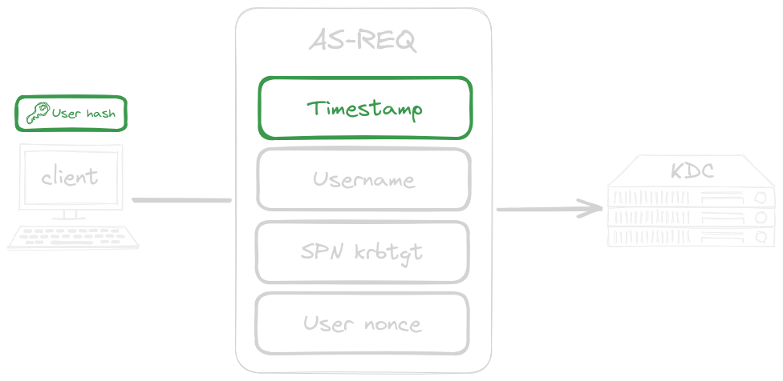
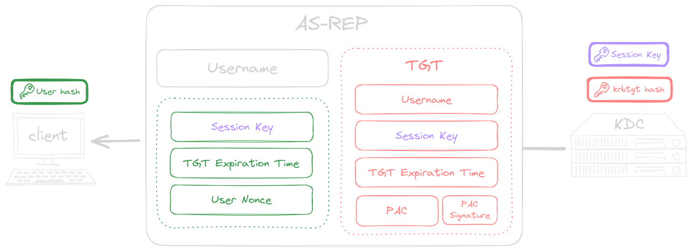
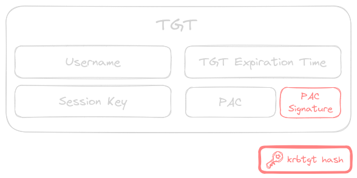
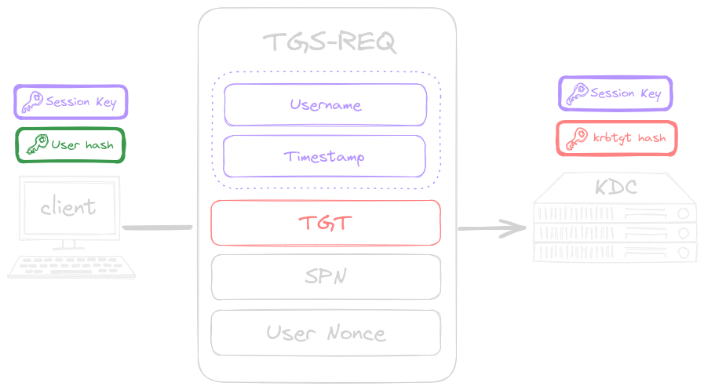
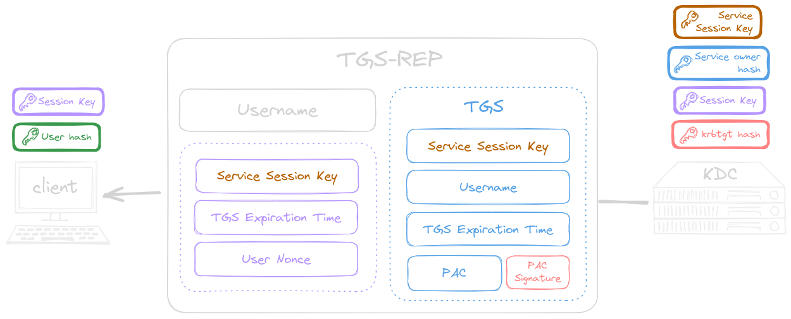
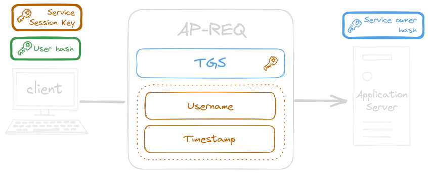
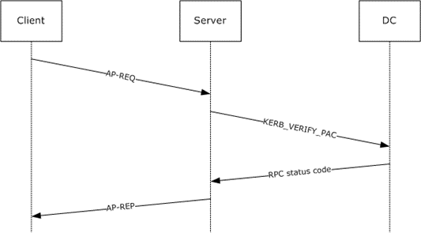

public:: true

- #+BEGIN_QUOTE
  [RFC4120](https://www.rfc-editor.org/rfc/rfc4120): The Kerberos Network Authentication Service (V5)
  #+END_QUOTE
- A key difference between Kerberos and [NTLM Authentication]([[AD NTLM Authentication]]) is that with the latter the client starts the authentication process with the application server itself. On the other hand, Kerberos client authentication involves the use of a domain controller in the role of a **Key Distribution Center ([KDC](https://en.wikipedia.org/wiki/Key_distribution_center))**. The client starts the authentication process with the KDC and not the application server.
  id:: 655a4269-4fa1-4988-b577-ad77f90064c0
- The *KDC* *(Key Distribution Center)* holds a database of the keys used in the authentication process and consists of two main parts:
	- The  *Authentication Server service* responsible for authenticating clients.
	  logseq.order-list-type:: number
	- The *Ticket Granting Service* provides tickets and [TGT](((655b1bc6-5c5d-4c70-9d2b-f3f3d6458cb9))) to the client systems.
	  logseq.order-list-type:: number
- The *[Privilege Attribute Certificate](((655f3e21-772b-48c3-b6e6-bd342fb92403)))* (PAC) adds authorization capabilities to the Microsoft Kerberos implementation.
- User logon with Kerberos
  id:: 655a4269-b8f7-4f0f-b437-f04b362912d9
	- When a user logs in to their workstation, an *Authentication Server Request* (AS-REQ) is sent to the domain controller.
	  logseq.order-list-type:: number
	  id:: 655a1af9-9f7f-4089-8392-e6d816267e35
		- id:: 655b1c01-e1e1-4be0-b245-ff8c9482df38
		  #+BEGIN_PINNED
		  The **AS-REQ** *(Authentication Server Request)* contains:
		  #+END_PINNED
			- collapsed:: true
			  #+BEGIN_CENTER
			   
			  #+END_CENTER
				- {{renderer excalidraw, excalidraw-2023-11-23-18-29-28}}
			- The timestamp, **encrypted with the NTLM hash of the user's password**
			  id:: 655b158a-a666-41e0-8076-e59942a7bb20
			  logseq.order-list-type:: number
				- This is known as [*Kerberos Pre-Authentication*](https://social.technet.microsoft.com/wiki/contents/articles/23559.kerberos-pre-authentication-why-it-should-not-be-disabled.aspx) and prevents offline password guessing. It is enforced by default, but can be manually disabled for some accounts by explicitly setting [`DONT_REQ_PREAUTH`](https://learn.microsoft.com/en-US/troubleshoot/windows-server/identity/useraccountcontrol-manipulate-account-properties).
				  id:: 655cc72a-f6bf-40d2-bba0-8384e40186b9
			- The username
			  logseq.order-list-type:: number
			- The service [SPN](((655e0fad-5b48-42ce-b82a-09cd0e4a9322))) associated with *krbtgt* account
			  logseq.order-list-type:: number
			- A Nonce generated by the user
			  logseq.order-list-type:: number
				- TODO For what is it used??
				  background-color:: pink
	- Once the KDC received the request, it uses the user's password hash *(stored in the NTDS.dit file)* to decrypt the timestamp.
	  logseq.order-list-type:: number
		- In order to defeat potential [replay attacks](https://en.wikipedia.org/wiki/Replay_attack) attempts, it checks if the **same timestamp** was already submitted within a previous AS-REQ. If so the authentication fails.
		  logseq.order-list-type:: number
		- If the decryption succeeds and the provided timestamp was never submitted before, then the authentication succeeds.
		  logseq.order-list-type:: number
	- The domain controller replies to the client with an *Authentication Server Reply* (AS-REP).
	  logseq.order-list-type:: number
	  id:: 655a1fb1-47f5-446a-8813-e1a809f05a7b
		- id:: 655b1795-7a37-4e7f-b428-6c9a34ab2cbf
		  #+BEGIN_PINNED
		  The **AS-REP** *(Authentication Server Reply)* contains:
		  #+END_PINNED
			- collapsed:: true
			  #+BEGIN_CENTER
			   
			  #+END_CENTER
				- {{renderer excalidraw, excalidraw-2023-11-23-18-50-49}}
			- The username
			  logseq.order-list-type:: number
			- A session key, **encrypted with the user's password hash**.
			  logseq.order-list-type:: number
			  id:: 655a201b-448f-45dc-a8b7-2c8978dde0c2
			- TGT expiration time,  **encrypted with the user's password hash**
			  logseq.order-list-type:: number
			- User nonce, **encrypted with the user's password hash**.
			  logseq.order-list-type:: number
				- To prevent [replay attacks](https://en.wikipedia.org/wiki/Replay_attack)
			- A *Ticket-Granting Ticket* (TGT) **encrypted with a secret key (NTLM hash of the *krbtgt* account)** known only to the KDC. *(Cannot be decrypted by the client)*
			  logseq.order-list-type:: number
			  id:: 655a4269-21dc-4947-a21d-5c89e404b561
				- id:: 655b1bc6-5c5d-4c70-9d2b-f3f3d6458cb9
				  #+BEGIN_PINNED
				  The **TGT** *(Ticket-Granting Ticket)* contains:
				  #+END_PINNED
					- collapsed:: true
					  #+BEGIN_CENTER
					   
					  #+END_CENTER
						- {{renderer excalidraw, excalidraw-2023-11-23-19-11-52}}
					- Username
					  logseq.order-list-type:: number
					- The same [session key above](((655b1795-7a37-4e7f-b428-6c9a34ab2cbf))), but **not encrypted** with the user's password hash.
					  logseq.order-list-type:: number
					- The *[Privilege Attribute Certificate](((655f3e21-772b-48c3-b6e6-bd342fb92403)))* (PAC).
					  logseq.order-list-type:: number
						- It defines the user's privileges (e.g. group memberships)
						- It will be later used for authorization checks, when the user will requests access to domain services.
					- A signature for the PAC made by the *krbtgt* account
					  logseq.order-list-type:: number
					- TGT expiration time
					  logseq.order-list-type:: number
						- id:: 655f6c2b-0127-41cd-b199-ed9eb7ea1869
						  #+BEGIN_NOTE
						  🕒 By default, the TGT will be valid for ten hours, after which a renewal occurs. This renewal does not require the user to re-enter their password.
						  #+END_NOTE
	- The authentication is now considered complete.
	  logseq.order-list-type:: number
- User request access to a domain service
	- 
		- [Authentication Server Request](((655a4269-b8f7-4f0f-b437-f04b362912d9)))
		  logseq.order-list-type:: number
		- [Authentication server Replay](((655a4269-b8f7-4f0f-b437-f04b362912d9)))
		  logseq.order-list-type:: number
		- Now that the user is authenticated and has obtained a [session key](((655b1795-7a37-4e7f-b428-6c9a34ab2cbf))), he can craft *Ticket Granting Service Request* (TGS-REQ) to request access to domain services. As we [initially said](((655a4269-4fa1-4988-b577-ad77f90064c0))), this access request is filed against the KDC and not directly to the application server. Hence, the user (or client) will send the TGS-REQ to the KDC.
		  logseq.order-list-type:: number
		  id:: 655a4269-a509-429f-95ea-ce8b6582cf9c
			- #+BEGIN_PINNED
			  The **TGS-REQ** *(Ticket Granting Service Request)* contains:
			  #+END_PINNED
				- collapsed:: true
				  #+BEGIN_CENTER
				    
				  #+END_CENTER
					- {{renderer excalidraw, excalidraw-2023-11-23-19-19-53}}
				- Username, **encrypted with the [session key](((655b1795-7a37-4e7f-b428-6c9a34ab2cbf)))**
				  logseq.order-list-type:: number
				- A timestamp, **encrypted with the [session key](((655b1795-7a37-4e7f-b428-6c9a34ab2cbf)))**
				  logseq.order-list-type:: number
				- The SPN of the requested service
				  logseq.order-list-type:: number
				- A Nonce generated by the user
				  logseq.order-list-type:: number
				- The [TGT](((655a4269-21dc-4947-a21d-5c89e404b561))) as it was provided by the KDC at authentication time. **Encrypted with a secret key** (NTLM hash of the *krbtgt* account) **only known by the KDC**.
				  logseq.order-list-type:: number
		- The KDC can now validate the TGS-REQ and issue a *Ticket Granting Server Reply* (TGS-REP) to authorized the client to access the domain service.
		  logseq.order-list-type:: number
		  id:: 655a4269-b646-4744-a627-d2bb3f12a32d
			- The KDC decrypt the TGT using the secret key only known by the KDC (NTLM hash of the *krbtgt* account) and perform some validation checks.
			  logseq.order-list-type:: number
				- It first extracts the session key and uses it to decrypt the username and timestamp in the TGS-REQ.
				  logseq.order-list-type:: number
				- At this point the KDC performs several checks:
				  logseq.order-list-type:: number
					- The TGT must have a [valid timestamp](((655f6c2b-0127-41cd-b199-ed9eb7ea1869))).
					  logseq.order-list-type:: number
					  id:: 655b6438-437b-48c4-98c3-c703c1703b4c
					- The username from the TGS-REQ has to match the username from the TGT.
					  logseq.order-list-type:: number
			- If the validation process succeeded, then the *ticket-granting service* (KDC) reply to the client with a *Ticket Granting Service Reply* (TGS-REP).
			  logseq.order-list-type:: number
			  id:: 655b6438-aa29-434b-bdf9-75e172e85fd1
				- id:: 655b6438-ee0f-4168-8a40-754613d2b793
				  #+BEGIN_PINNED
				  The **TGS-REP** *(Ticket Granting Service Reply)* contains:
				  #+END_PINNED
					- collapsed:: true
					  #+BEGIN_CENTER
					    
					  #+END_CENTER
						- {{renderer excalidraw, excalidraw-2023-11-23-19-29-30}}
					- Username
					  logseq.order-list-type:: number
					- The name of the service for which access has been granted, **encrypted with the original [session key](((655b1795-7a37-4e7f-b428-6c9a34ab2cbf)))**.
					  logseq.order-list-type:: number
					  background-color:: pink
					- TGS expiration time, **encrypted with the original [session key](((655b1795-7a37-4e7f-b428-6c9a34ab2cbf)))**.
					  logseq.order-list-type:: number
					- User nonce, **encrypted with the original [session key](((655b1795-7a37-4e7f-b428-6c9a34ab2cbf)))**.
					  logseq.order-list-type:: number
						- To prevent [replay attacks](https://en.wikipedia.org/wiki/Replay_attack)
					- A new session key to be used between the client and the application server, **encrypted with the original [session key](((655b1795-7a37-4e7f-b428-6c9a34ab2cbf)))**.
					  logseq.order-list-type:: number
					  id:: 655a24b4-cedb-469a-91c2-8d5e46cbcd2c
					- The TGS *(AKA service ticket)* **encrypted with the NTLM hash of password of the account associated to the service in question**. *Hence, only the application server can decrypt it.*
					  logseq.order-list-type:: number
					  id:: 655a24c7-b91e-4a45-8468-c565395f566e
						- id:: 655b24f3-a272-4dc0-814f-e7b3a4edf632
						  #+BEGIN_PINNED
						  The **service ticket** contains:
						  #+END_PINNED
							- Username of the user who requests access
							  logseq.order-list-type:: number
							  id:: 655a30e3-6c13-444a-ad0a-b658667284e7
							- The newly created [session key](((655a24b4-cedb-469a-91c2-8d5e46cbcd2c)))
							  logseq.order-list-type:: number
							  id:: 655a30e9-90ec-4d1e-84b5-7ff17bc27a29
							- TGS expiration time
							  logseq.order-list-type:: number
							- The *[Privilege Attribute Certificate](((655f3e21-772b-48c3-b6e6-bd342fb92403)))* (PAC). As it was defined at [TGT](((655b1bc6-5c5d-4c70-9d2b-f3f3d6458cb9))) creation time.
							  logseq.order-list-type:: number
								- It defines the user's privileges (e.g. group memberships)
							- A signature for the PAC made by the *krbtgt* account
							  logseq.order-list-type:: number
		- Now that the client has both the newly created [*session key*](((655a24b4-cedb-469a-91c2-8d5e46cbcd2c))) and the [*service ticket*](((655a24c7-b91e-4a45-8468-c565395f566e))), it can authenticate against the application server that hosts the domain service the user wants access to. In order to do that the client crafts an *Application Request* (AP-REQ) and send it to the application server.
		  logseq.order-list-type:: number
			- id:: 655b6438-0c6c-4798-8605-4ec335233a45
			  #+BEGIN_PINNED
			  The **AP-REQ** *(Application Request)* contains:
			  #+END_PINNED
				- collapsed:: true
				  #+BEGIN_CENTER
				  
				  #+END_CENTER
					- {{renderer excalidraw, excalidraw-2023-11-23-19-41-03}}
				- The username, **encrypted the newly created [session key](((655a24b4-cedb-469a-91c2-8d5e46cbcd2c)))** *(the one associated with the service ticket)*.
				  logseq.order-list-type:: number
				- The timestamp, **encrypted the newly created [session key](((655a24b4-cedb-469a-91c2-8d5e46cbcd2c)))** *(the one associated with the service ticket)*.
				  logseq.order-list-type:: number
				- The [service ticket](((655a24c7-b91e-4a45-8468-c565395f566e))), **encrypted with the NTLM hash of the password of the account associated to the service in question**.
				  logseq.order-list-type:: number
				  id:: 655b6438-17f0-4630-8e60-b35fe308c2ca
					- id:: 655f62ff-40e9-40b2-941d-4e6e4b6faece
					  #+BEGIN_NOTE
					  A client can [avoid to include the PAC](((655f5e6d-8301-4c72-992f-da004b0b9bc5))) in the created AP-REQ.
					  #+END_NOTE
		- Once the application server receives the AP-REQ it process it and eventually grant access to user to the requested service.
		  logseq.order-list-type:: number
		  id:: 655b6438-6055-4038-b37b-457c7b623610
			- The application server decrypts the [TGS](((655b24f3-a272-4dc0-814f-e7b3a4edf632))) and reads the following information. *(Please remind that the TGS was encrypted by the KDC in a way that it is only readable by the application server.)*
			  logseq.order-list-type:: number
				- The username of the user who requests access
				  logseq.order-list-type:: number
				- The newly created [session key](((655a24b4-cedb-469a-91c2-8d5e46cbcd2c)))
				  logseq.order-list-type:: number
				- TGS expiration time
				  logseq.order-list-type:: number
				- The *[Privilege Attribute Certificate](((655f3e21-772b-48c3-b6e6-bd342fb92403)))* (PAC). *(If not stripped out by the client at [AP-REQ creation time](((655b6438-0c6c-4798-8605-4ec335233a45))))*
				  logseq.order-list-type:: number
					- The group memberships of the user who requests access is here
			- It now uses these information to check if the request is legit
			  logseq.order-list-type:: number
				- Check if the TGS is not expired.
				- Checks if the username provided by the client in the AP-REQ matches the one in the TGS.
				- Inspects the supplied group memberships and assigns appropriate permissions to the user. *(Can the user access the resource he's requesting?)*
				- id:: 655b6438-5c8b-457f-a027-dffc35de2193
				  #+BEGIN_CAUTION
				  Fun fact, in the majority of environments user and group permissions **are not verified** by the application.
				  
				  Most applications **blindly trust** the integrity of the service ticket since it is encrypted with a password hash that is, in theory, only known to the [service account and the domain controller](((655b6438-17f0-4630-8e60-b35fe308c2ca))).
				  #+END_CAUTION
				- If [PAC validation is enabled](((655f4e98-766b-46fd-94f0-c385b24b5160))), the application server contacts the KDC to validate the signature of the received PAC.
				- #+BEGIN_TIP
				  If the application server **doesn't check group permissions** and **PAC validation is disabled**, attackers can attempt the [[Silver Tickets]] attack.
				  #+END_TIP
			- If everything went right, access to the service is granted.
			  logseq.order-list-type:: number
			- In case mutual authentication is needed, the service can return an AP-REP to the user.
			  logseq.order-list-type:: number
				- This is optional and only used if the service wants to identify itself against the user
				- id:: 655fb0f2-d109-45fd-bf94-28ce90974744
				  #+BEGIN_PINNED
				  The **AP-REP** *(Application Reply)* contains:
				  #+END_PINNED
					- TODO asd
					  logseq.order-list-type:: number
					- TODO asd
					  logseq.order-list-type:: number
					- TODO asd
					  logseq.order-list-type:: number
- *Privilege Attribute Certificate* (PAC)
  id:: 655f3e21-772b-48c3-b6e6-bd342fb92403
	- [PAC](https://learn.microsoft.com/en-us/openspecs/windows_protocols/ms-apds/a00d0b83-97e3-44ad-ba2d-1221d4f51a35#gt_26456104-0afb-4afe-a92e-ac160a9efdf8) is a **[Microsoft-specific](https://learn.microsoft.com/en-us/openspecs/windows_protocols/ms-pac/166d8064-c863-41e1-9c23-edaaa5f36962)** authorization data structure present in the *authorization data* field of many tickets.
		- #+BEGIN_PINNED
		  The **PAC** *(Privilege Attribute Certificate)* contains:
		  #+END_PINNED
			- The PAC **is encrypted with???**
			- Security identifiers (SIDs)
			  logseq.order-list-type:: number
			- Group memberships
			  logseq.order-list-type:: number
			- Profile and policy information
			  logseq.order-list-type:: number
			- Additional credential **encrypted with ???**.
			  logseq.order-list-type:: number
	- PAC validation is an optional process between the server application and the domain controller. If enabled, when the user request access to a domain service his privileges **are validated by the domain controller**.
		- id:: 655f5e6d-8301-4c72-992f-da004b0b9bc5
		  #+BEGIN_NOTE
		  The client can avoid the inclusion of the PAC inside the service ticket by specifying it in [`KERB-PA-PAC-REQUEST`](https://learn.microsoft.com/en-us/openspecs/windows_protocols/ms-kile/765795ba-9e05-4220-9bd3-b34464e413a7) field of ticket request.
		  #+END_NOTE
	- Since the Kerberos protocol **does not provide authorization** the *Privilege Attribute Certificate* was created by Microsoft to provide authorization via *Kerberos Protocol Extensions*.
	- PAC [validation workflow](https://learn.microsoft.com/en-us/openspecs/windows_protocols/ms-apds/1d1f2b0c-8e8a-4d2a-8665-508d04976f84)
	  
		- The user already got a [service ticket](((655a24c7-b91e-4a45-8468-c565395f566e))) from the KDC.
		  logseq.order-list-type:: number
		- The user craft and send an [AP-REQ](((655b6438-0c6c-4798-8605-4ec335233a45))) to the application server.
		  logseq.order-list-type:: number
		- If the application server performs PAC validation, it extracts the PAC from the *service ticket* and pass it to the underling OS, which in turn sends it to the KDC asking for a validation via a `KERB_VERIFY_PAC` message.
		  logseq.order-list-type:: number
		- The domain controller perform the verification and return the outcome (RPC status code) to the application server.
		  logseq.order-list-type:: number
		- The application server provides the [AP-REP](((655fb0f2-d109-45fd-bf94-28ce90974744))) to the user only if the verification was successful.
		  logseq.order-list-type:: number
	- Check if PAC validation is enabled on the target machine
	  id:: 655f4e98-766b-46fd-94f0-c385b24b5160
		- By checking `HKEY_LOCAL_MACHINE\SYSTEM\CurrentControlSet\Control\Lsa\Kerberos\Parameters` you can determine if PAC is enabled on the target machine.
			- It is disabled when the value is `0`.
			  logseq.order-list-type:: number
			- It is enabled when the value is `1`.
			  logseq.order-list-type:: number
			- It is enabled if the entry does not exist.
			  logseq.order-list-type:: number