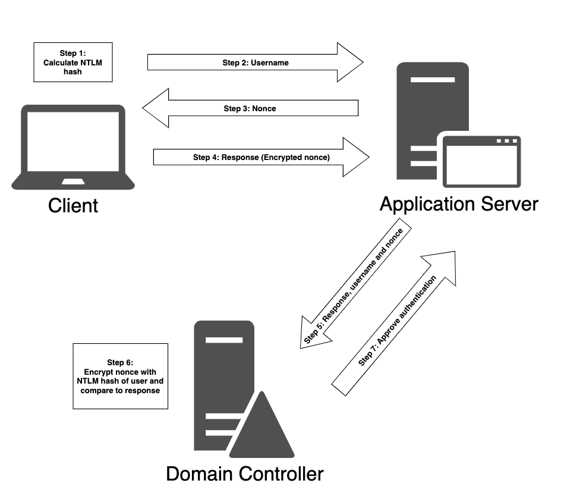

public:: true

- {:height 679, :width 755}
  id:: 655a16df-04a2-4aa6-a1b7-b556ab3c4899
	- The client calculates a cryptographic hash, called the *NTLM hash*, from the user's password.
	  logseq.order-list-type:: number
	- The client sends the username to the application server.
	  logseq.order-list-type:: number
	- The application server generated a random number (*nonce* or *challenge*) and return it to the client.
	  logseq.order-list-type:: number
	- The client encrypts the nonce using the NTLM hash, now known as a *response*, and sends it back to the application server.
	  logseq.order-list-type:: number
	- The application server forwards the response along with the username and the nonce to the domain controller for validation.
	  logseq.order-list-type:: number
	- The domain controller can validate the challenge, since it already knows the NTLM hash of all users' password.
	  logseq.order-list-type:: number
		- The domain controller encrypts the nonce itself with the NTLM hash of the supplied username and compares it to the response received from the application server.
		  logseq.order-list-type:: number
	- The domain controller return the outcome of the validation process (*Approved or Not Approved*) to the application server.
	  logseq.order-list-type:: number