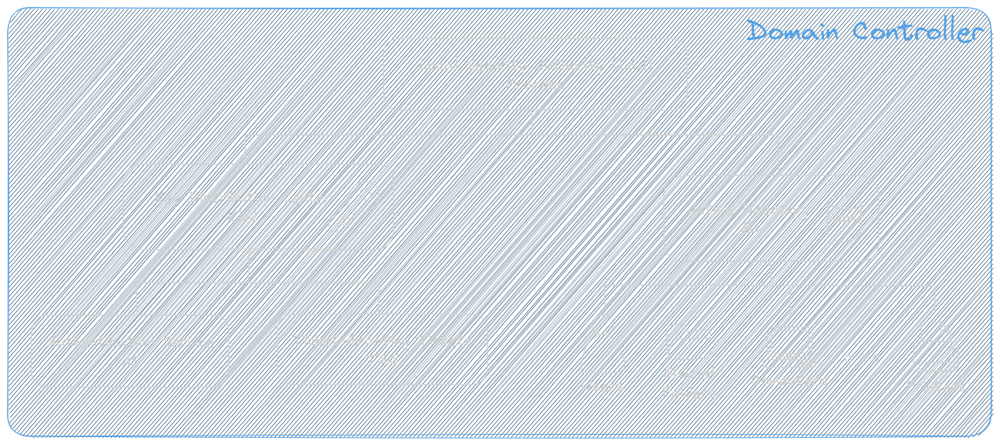

public:: true

- The **[Domain Controller](https://learn.microsoft.com/en-us/previous-versions/windows/it-pro/windows-server-2003/cc786438(v=ws.10))** is a server that provides all the services needed for managing activities occurring in your IT environment. In particular, it makes sure each person is who they claim to be (*authentication*) and allow them to access only the data they’re allowed to use (*authorization*). There are several services running on it, like:
	- The **AD** *([Active Directory](https://learn.microsoft.com/en-us/windows-server/identity/ad-ds/get-started/virtual-dc/active-directory-domain-services-overview))*, it is a database (directory) holding information about AD objects in the domain. Common types of AD objects include: User, Groups, Computers, Applications, Printers, Shared folders.
	- The **KDC** *([Key Distribution Center](https://learn.microsoft.com/en-us/windows/win32/secauthn/key-distribution-center))* holds a database of the keys used in the authentication process and consists of two main parts:
	  id:: 6565b3f7-61b6-4b2a-a59d-01d20e6acd96
		- The  *Authentication Service* (AS) responsible for authenticating clients and issuing [TGT](((655b1bc6-5c5d-4c70-9d2b-f3f3d6458cb9)))s.
		  logseq.order-list-type:: number
		- The *Ticket Granting Service* (TGS) issues [tickets](((655a24c7-b91e-4a45-8468-c565395f566e))) for connection to computers in its own domain.
		  logseq.order-list-type:: number
	- According to [Microsoft](https://learn.microsoft.com/en-us/windows/win32/secauthn/key-distribution-center), KDC and AD are located on the domain controller. Both services are started automatically by the domain controller's *Local Security Authority* (LSA) and run as part of the LSA's process.
		- collapsed:: true
		  #+BEGIN_CENTER
		  
		  #+END_CENTER
			- {{renderer excalidraw, excalidraw-2023-11-28-10-52-09}}
- Service Principal Name ([SPN](https://learn.microsoft.com/en-us/windows/win32/ad/service-principal-names))
  id:: 655e0fad-5b48-42ce-b82a-09cd0e4a9322
	- SPN is a concept from [[Kerberos]]. It's an identifier for a particular service offered by a particular host within an authentication domain.
	- It's assigned to application instance when they are registered in the Active Directory ("Kerberized" service). This also allows for easy management for administrators and gets a better integration with other AD objects and services.
	- [[Kerberos]] uses SPNs to associate a service instance with a service account, usually the AD computer account.
		- If a SPN is associated to an **AD user account**, then the [[Kerberoasting]] attack can be execute attempting to retrieve the user's password.
		- For computer accounts, [managed service accounts](https://techcommunity.microsoft.com/t5/ask-the-directory-services-team/managed-service-accounts-understanding-implementing-best/ba-p/397009), and [group-managed service accounts](https://learn.microsoft.com/en-us/windows-server/security/group-managed-service-accounts/group-managed-service-accounts-overview) the password is randomly generated, complex, and 120 characters long, **making cracking infeasible**.
		  id:: 655e3185-f921-4b07-bb00-e397a2486fc6
	- The SPN consists of a string on the form of: `service class`/`fqdn`@`REALM`.
		- The `service class` can loosely be thought of as the protocol for the service.
			- The list of service classes that are built-in to Windows are [listed here](https://learn.microsoft.com/en-us/previous-versions/windows/it-pro/windows-server-2003/cc772815(v=ws.10)?redirectedfrom=MSDN#service-principal-names).
		- The `fqdn` is the *fully qualified domain name* of the computer hosting the service.
		- `REALM` is a Kerberos term to refer what in AD is called *domain*
		- Example: `IMAP/mail.example.com@EXAMPLE.COM`
- User Principal Name (UPN)
	- Similar to the SPN but for user objects
- Find the Primary Domain Controller
	- Within a domain there might be multiple DCs. In  that case the *domain name* could potentially resolve to the IP address of any of them.
	  
	  To make our enumeration as accurate as possible, we should look for the DC that
	  holds the most updated information. This is known as the [*Primary Domain Controller* (PDC)](https://portal.offsec.com/courses/pen-200/books-and-videos/modal/modules/active-directory-introduction-and-enumeration/active-directory-manual-enumeration/enumerating-active-directory-using-powershell-and-net-classes#fn6). There can be only one PDC in a domain. To find the PDC, we need to find the DC holding the ***PdcRoleOwner*** property.
	  ```powershell
	  PS C:\> [System.DirectoryServices.ActiveDirectory.Domain]::GetCurrentDomain()
	  ```
	  ```powershell
	  PS C:\> [System.DirectoryServices.ActiveDirectory.Domain]::GetCurrentDomain()
	  
	  Forest                  : corp.com
	  DomainControllers       : {DC1.corp.com}
	  Children                : {}
	  DomainMode              : Unknown
	  DomainModeLevel         : 7
	  Parent                  :
	  PdcRoleOwner			: DC1.corp.com
	  RidRoleOwner            : DC1.corp.com
	  InfrastructureRoleOwner : DC1.corp.com
	  Name                  	: corp.com
	  ```
	  Only return the PDC:
	  ```powershell
	  PS C:\> [System.DirectoryServices.ActiveDirectory.Domain]::GetCurrentDomain().PdcRoleOwner.Name
	  DC1.corp.com
	  ```