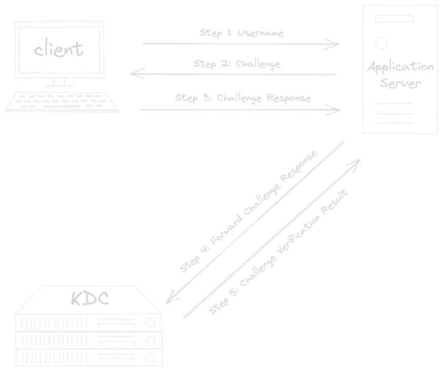

public:: true

- Windows New Technology LAN Manager ([NTLM](https://learn.microsoft.com/en-us/openspecs/windows_protocols/ms-nlmp/b38c36ed-2804-4868-a9ff-8dd3182128e4?redirectedfrom=MSDN)) is an outmoded challenge-response authentication protocol from Microsoft. Still in use though succeeded by [[Kerberos]].
- NTLM was replaced as the default authentication protocol in Windows 2000 by [[Kerberos]]. However, NTLM is still maintained in all Windows systems for compatibility purposes between older clients and servers and is used when the Kerberos Protocol Extensions (KILE) do not work, such as in the following scenarios.
	- One of the machines is not Kerberos-capable
	- The server is not joined to a domain
	- The KILE configuration is not set up correctly
	- The implementation chooses to directly use NLMP
- NTLM is a challenge-response style authentication protocol, let's see the workflow
	- collapsed:: true
	  #+BEGIN_CENTER
	  
	  #+END_CENTER
		- {{renderer excalidraw, excalidraw-2023-11-27-16-52-38}}
	- The client initiate the authentication process by sending the username to the application server.
	  logseq.order-list-type:: number
	- The application server generated a random number (*nonce* or *challenge*) and return it to the client.
	  logseq.order-list-type:: number
	- The client encrypts the nonce using the user (NTLM hash) password, from now known as *response*, and sends it back to the application server.
	  logseq.order-list-type:: number
	- The application server forwards the *response* along with the *username* and *challenge (plain-text)* to the domain controller for validation.
	  logseq.order-list-type:: number
	- The domain controller can validate the challenge, since it already knows the password (NTLM hash) for any domain user.
	  logseq.order-list-type:: number
		- The domain controller encrypts the *challenge* itself with the password (NTLM hash) of the supplied *username* and compares it to the *response*.
		- The domain controller return the outcome of the validation process (*Approved or Not Approved*) to the application server.